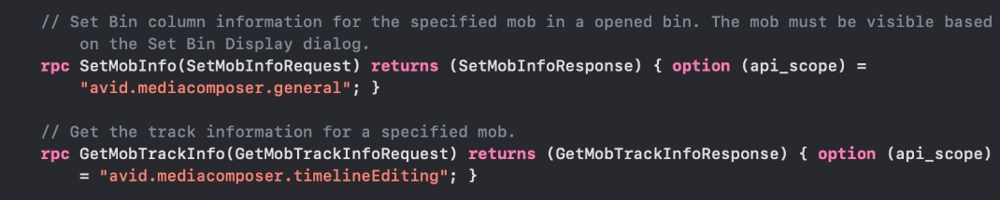

# Create a Media Composer Plug-in

## Introduction
This tutorial provides a basic introduction to working with the Media Composer API in Javascript. 

You will learn how to:

- Create a Media Composer plugin which loads a webpage from a remote host.
- Write a simple client using Media Composer javascript API.
- Create a simple server that serves html page that can make requests to Media Composer.

**Note:** All the action items are denoted by a bullet symbol.

### Prerequisites

The files found in _PanelSDK/samples/sample-plugin_

### Steps

**1. Create the manifest file**

The manifest file defines various information about the plugin such as name, version, scope, and especially the UI elements that will be displayed.

**2. Create a folder, name it “sample-plugin”.** <br>
**3. Create a text file inside the `sample-plugin` folder.**  <br>
**4. Name the file “avid-manifest.json”.**  <br>
**5. Copy the following content to the file:**  <br>

```
{
    "category" : "suite-plugin",
    "name": "com.avid.sample.plugin",
    "version": "0.0.1",
    "displayName": "Remote URL sample",
    "description": "Simple remote URL sample",
    "usesApi": [
        "avid.mediacomposer.general"
    ],
    "subscribesToChannels": [
    ],
    "entitlements": [
    ],
    "companyPrefix": "abcxyz",
    "appShortName": "sample.remote.url",
    "uiItems": [
        {
        "type": "dropdown",
        "menuName": "Tools",
        "id": "api sample",
        "displayText": "Simple Echo",
        "icon": "static/application.svg",
        "url": "http://localhost:3000"
        }
    ],
    "windowSize": {
        "initial": {
            "width": "600",
            "height": "200"
    }
    },
    "targetHosts": [
        "MediaComposer"
    ],
    "allowedDomains": [
        "localhost:3000"
    ],
    "windowStyle": "floating",
        "singleton": true
    }

```

**Property Reference**

`name` property serves as a unique identifier for the plugin, and it is recommended to use the reverse domain notation for naming. 

`companyPrefix` The companyPrefix property lets you define your company name. This prefix will be automatically added to the beginning (prepended) of your app's short name to create the plugin's unique ID. We will review these IDs to ensure there are no conflicts among registered plugins.

`uiItems` - Holds an array of UI items. Each UI item is associated with a web browser window which can be opened inside Media Composer.

```
{
    "type": "dropdown",
    "menuName": "Tools",
    "id": "api sample",
    "displayText": "Simple Echo",
    "icon": "static/application.svg",
    "url": "http://localhost:3000"    
}

```
`menuName` - Indicates from which menu to open the plugin panel. In the example, a new menu item called "Simple Echo" appear in the Tools menu.

`displayText` property specifies the name that will be used as the menu text in Media Composer. In this example, under the Tools menu, there will be a new menu item called “Simple Echo”. 

`icon` - Specifies the plugin’s icon. In the example, it is called `application.svg` and is in the static folder. 

`url` - Specifies the address of your webpage. In the example, the url is http://localhost:3000. In production, the URL should be a valid address to your remote server. Be sure to specify all the domains that are accessible from the plugin in allowedDomains property.

`allowedDomains` - Lists an array of all domains that the plugin allows. The plugin blocks access to any domains that `allowedDomains` does not specify.

> 
> **Note:** Each element in this list has to be in one of the following formats:
>
> - localhost: `<port_number>`
> - hostname.com
> - subdomain.hostname.com
>
> If no subdomain is specified, all subdomains will be allowed.
> If a subdomain is specified, only subdomains of the specified subdomain will be allowed.
>

`usesApi` - Lists all ”API scopes”. An API scope is an authorized group of API the plugin can access. If a plugin uses an API in a scope that is not authorized, the access will be denied. Please check out “PanelSDK/proto/MCAPI.proto”. Each API specifies the scope that it belongs to. If your plugin uses SetMobInfo API, for example, its scope avid.mediacomposer.general must be specified. Likewise, GetMobTrackInfo requires “avid.mediacomposer.timelineEditing“.

<!--
focus: false
bg: "#ffffff"
-->



**6. Place an icon image file**

As the icon property specifies, we need an image file called `application.svg` which is placed in a folder called `static`.

- In sample-plugin folder, Create a new folder called `static` in the folder `sample-plugin.
- Then place your icon image file inside `static`. Name the icon file `application.svg`.
At the minimum, a plugin would contain a manifest file and an icon.

Here is an example:

sample-plugin <br>
└───avid-manifest.json <br> 
└───static <br>
└───application.svg <br><br>

**7. Zip the plugin**

To complete the plug-in creation:
 1. Navigate to the `sample-plugin` directory.
 2. Select all of the files in the folder and zip them.
 3. Name the ZIP file `samplecho.avpi`

Congratulations! You’ve just created your first Media Composer plug-in!

### Next Steps

Learn how to install the plug-in.

- [Install a Media Composer Plug-in](2-install-plugin.md)