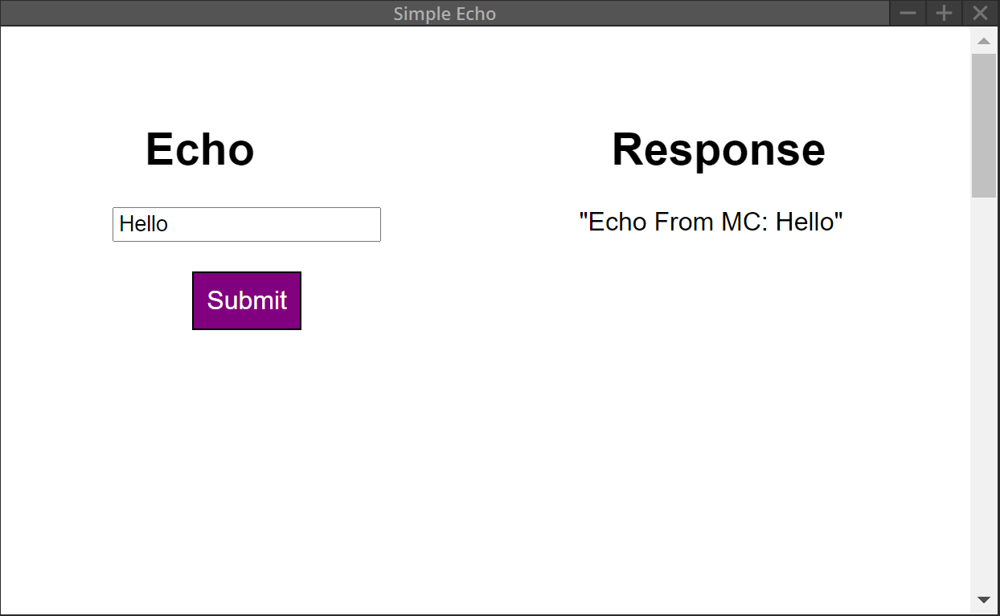

# Deploy the web app

## Introduction

This tutorial shows you how deploy the web app that you built in a previous tutorial.

## Prerequisites

- Tutorial - [Build the App](9-build-the-app.md)

## Steps

1. Copy three files to the folder `sample-server` 
    - `echo/src/index.html`
    - `echo/src/echo.css`
    - `echo/dist/echo.js`

The folder structure looks like this: 

sample-server  
└─── index.html  
└─── echo.css  
└─── echo.js  

2. Reload the plug-in panel in Media Composer. 
3. After the UI appears in the panel, enter some text in the text box and hit `Submit`.  

### Next Steps
Learn how to sign the plugin to get ready to distribute to the users.
- [Sign the Plugin](plugin-signing-process.md)