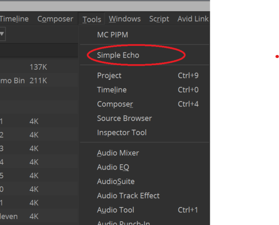
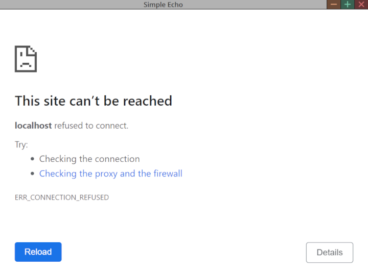

# Install a Media Composer Plug-in

## Introduction

This tutorial shows you how to install the Media Composer Plug-in.

You will learn how to:

- Where to place your plug-in files for Media Composer to find them.
- How to test your plug-in.

## Prerequisites

A completed plug-in as outlined in the section [Create a Media Composer Plug-in](1-create-mc-plugin.md)

## Steps

**1. Place your ZIP file**

Place the file `sampleecho.avpi` in `%ProgramData%\Avid\PanelSDKPlugins`. 

> **Note:** On Mac, place the plugin at `/Library/Application Support/Avid/PanelSDKPlugins`

**2. Relaunch Media Composer** 

On relaunch, Media Composer picks up the plugin and creates UI items as defined in the manifest file.

- Go to Tools Menu, you should see the new "Simple Echo" menu item.

<!--
focus: false
bg: "#ffffff"
-->
    
   

- Click on “Simple Echo” to open the plugin panel. Since the url property points to localhost:3000 which has not been set up yet, the plugin panel will display some error indicating the webpage cannot be reached. 

<!--
focus: false
bg: "#ffffff"
-->

- To solve this error, we need to create our own server which runs on `http://localhost:3000`. 

### Next Steps

Learn how to create a simple web server.

- [Create a Simple Web Server](3-create-webserver.md)