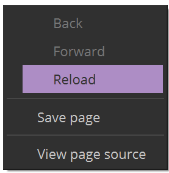
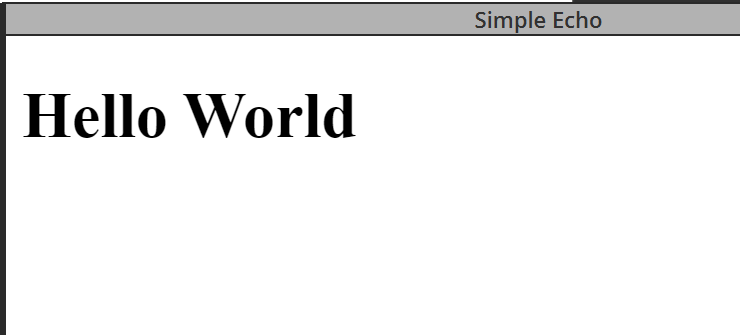

# Run the web server

## Introduction

This tutorial shows you how to run the web server that you created in a past tutorial.

## Prerequisites

- Tutorial - [Create a Simple Web server](3-create-webserver.md)
- Python 3 installed on your local machine

## Steps

1. Open a command line 
2. Navigate to the directory `sample-server`
3. Run the server with the following command:

  ```
  $ python3 -m http.server 3000
  ```
4. Reload the plugin panel in Media Composer
  
  - Right click on the plugin panel and click Reload. 

<!--
focus: false
bg: "#ffffff"
-->



The plugin panel now display “Hello World“

<!--
focus: false
bg: "#ffffff"
-->



### Next Steps

So far, we have created a plugin which can be loaded in Media Composer, and the plugin can open a valid page from a server. However there is no communication between the Plugin Panel and Media Composer. Next, we will use the javascript library provided in the PanelSDK to make requests and receive data from Media Composer.

Learn how to create requests from the panel.

- [Create Requests from the Plugin Panel](5-create-mc-request.md)