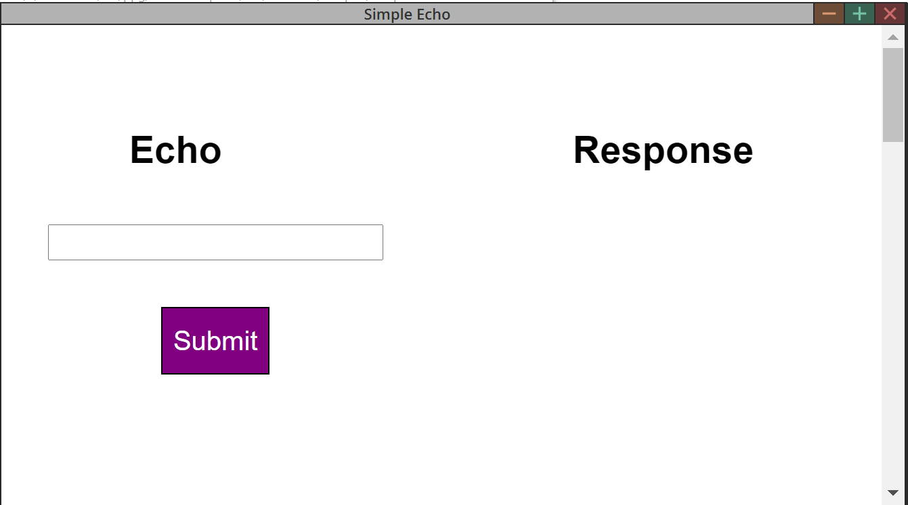

# Create requests from the Plugin Panel

## Introduction

This tutorial shows you how to use the javascript library provided in the PanelSDK to make requests and receive data from Media Composer.

## Prerequisites

- Tutorial - [Run the Web Server](4-run-webserver.md)

## Steps

> Note: The full sample code used in this example can be found in PanelSDK/samples/echo/

In the previous example, we started a server to serve a simple webpage that does nothing but display “Hello World“ text. We will replace that webpage by a more sophisticated one which uses Media Composer javascript library. 

At the end of the this example, we will create a webpage from which we send an echo request to Media Composer, and get back the echo message from it. 

> Note: When Media Composer launches, it will start a server which listens to requests coming from the Plugin Panels. This server runs on localhost:[some port number]. 

The new page we will create looks something like this: 

<!--
focus: false
bg: "#ffffff"
-->

User can enter a message in the text box, then click the submit button. Media Composer will response to the request. Then the Plugin Panel will display the response under the Response section.

### Next Steps

Learn how to set up the web app

- [Configure the Web App](6-set-up-web-app.md)

