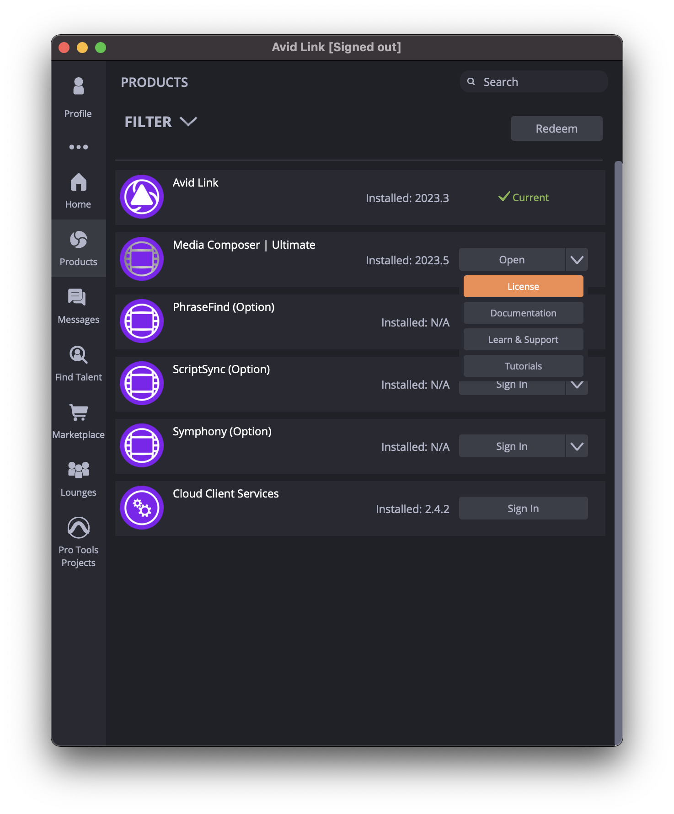
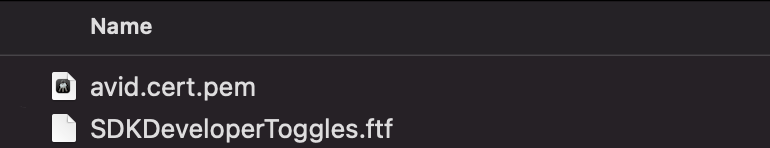
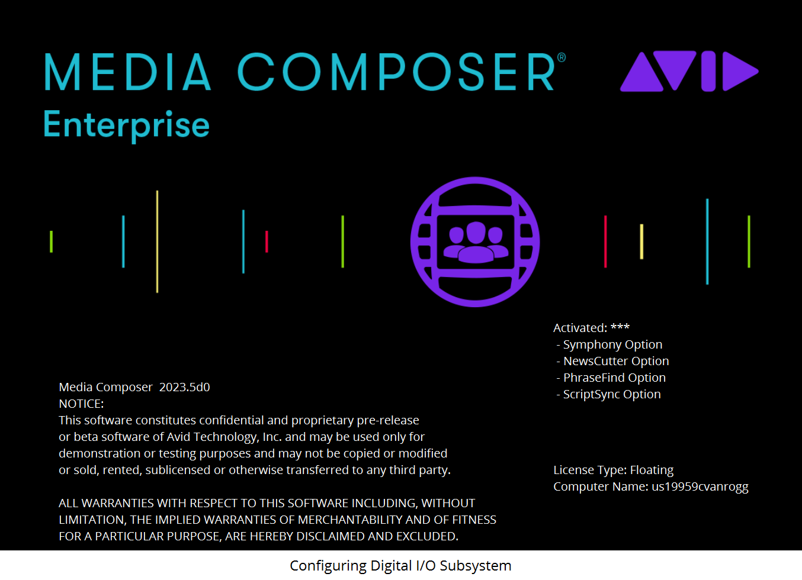
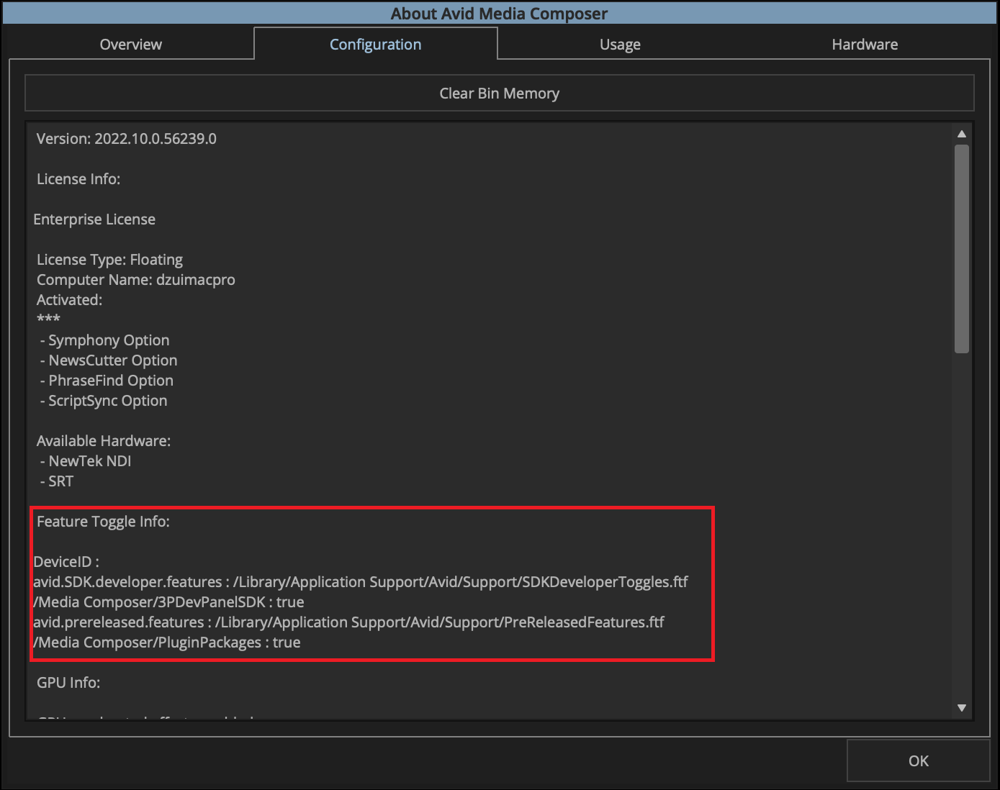

# Media Composer Panel SDK: Getting Started

## Introduction

Welcome to the Media Composer Panel SDK integration program. This guide contains what you need to get up and running.

## Prerequisites

To start developing a plugin for the Media Composer Panel SDK, you will need the following:

- a signed agreement with Avid
- a Media Composer Ultimate or Enterprise License. 
- the latest Panel SDK integration bundle and corresponding Media Composer daily builds (Mac and/or PC)

## Steps

### 1. Set up Media Composer and send your Device ID to Avid

a. Install the provided Media Composer daily build on your Mac or PC.

b. Use Avid Link to get the Media Composer Ultimate or Enterprise License configured if it’s not already.

c. Forward to Avid the Device ID of any system that will be used during the integration so we can issue you a toggle file that enables development.   

> ### Finding Your Device ID
>
>To find your device ID, you have two options:
>
> ### Option 1 – Avid Link:
>
> a. Open the Avid Link software found in the main menu bar on Mac or in the tray on Windows. 
>b. Go to the Products tab and look for Media Composer in the Products list pane. 
>c. Click the down arrow on the right-hand side of the word “Open” and select “License”. 
>d. In the next window, look to the lower left corner and you should see your computer’s Device ID. 
>e. Copy and paste the device ID(s) into an email and forward back to us.
>
><!--
>focus: false
>bg: "#ffffff"
>-->
> 
>
> ### Option 2 – About this Media Composer
>
>a. Launch Media Composer and open a new or existing project. Note: If you don’t have a license yet you should be able to run in Trial mode. 
>b. Under the Avid Media Composer menu on Mac or the Help Menu on the PC, select **About Avid Media Composer** 
>c. Once the window is open choose the Configuration tab. 
>d. The Device ID can be seen listed about 6 items down. 
>e. Copy and paste the Device ID(s) into an email and forward back to us.

### 2. Install encrypted toggle files

a. Once we have your Device ID(s) we will generate toggle files and email them to you. After unzipping, you should have two files: 

<!--
focus: false
bg: "#ffffff"
-->
 

 b. Copy the files to 

**Mac:** /Library/Application Support/Avid/Support

**Windows:** %ProgramData%\Avid\Support

c. Relaunch Media Composer, and verify that your toggle file was found.  You can do this by searching for `***` next to “Activated” on the right side of the splash screen during launch:

<!--
focus: false
bg: "#ffffff"
-->
 

You can also find toggle information in the **Help->About Media Media Composer** dialog:

<!--
focus: false
bg: "#ffffff"
-->
 

If you do not see the Feature Toggle information, then please review where the files should be and relaunch Media Composer.

> Note: The purpose of the SDKDeveloperToggle is to allow you to develop your plugin bundle without having to sign it each time you change it.  When your development is complete, you will need to get your plugin bundle signed with your developer certificate, and then submit it to Avid for review and signing.  Your customers will not need an encrypted toggle file. They will use a signed version of your plugin.

### 3. Try one of the provided samples

Now that you have the SDKDeveloperToggle recognized by Media Composer, you should be able to use unsigned Panel SDK bundles with Media Composer. 

You can find the samples in the **Tutorials** section.
