# Debugging PanelSDK JavaScript

## Introduction 

The Basic API sample is “self-contained”, which means you don’t have to create a server to provide the contents for the web page.

## Prerequisite

- [The Basic API Project](/docs/tutorial/samples/basic-api.md)

## Steps

1. To build the plugin, cd to `PanelSDK/samples/basic-api`. Run the following commands:

  ```
  $ npm ci
  $ npm run package

  ```
A self-contained plugin hosts an entire website which can be accessed from Media Composer panel window. Since it contains all the website resources as well as all the required libraries, its size would be large and its web page is slow to load. However self-contained plugin is good for coding examples since it doesn’t require setting up a website.

2. Copy `avid-api-sample_0.1.0.avpi` to  the `PanelSDKPlugins` directory.

On Mac, copy the file to `/Library/Application Support/Avid/PanelSDKPlugins` to install the plugin.

On PC, copy to `%ProgramData%\Avid\PanelSDKPlugins`

3. Debug the application

**On Mac**

Before launching Media Composer, we need to set environment variable to enable JavaScript debugging in the browser.

The example uses port 6123.

```
QTWEBENGINE_REMOTE_DEBUGGING=<port>

```

Enter these two commands in the Terminal:

```
$ QTWEBENGINE_REMOTE_DEBUGGING=6123
$ open /Applications/Avid\ Media\ Composer/AvidMediaComposer.app

```
<br>

<!--
focus: false
bg: "#ffffff"
-->

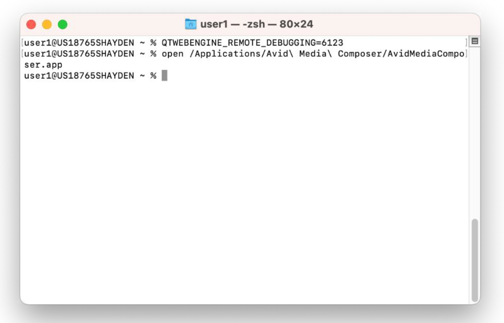

4. Open the project after Media Composer has launched.
5. Open “Avid Media Composer API Sample“ from the Tools menu.

<!--
focus: false
bg: "#ffffff"
-->

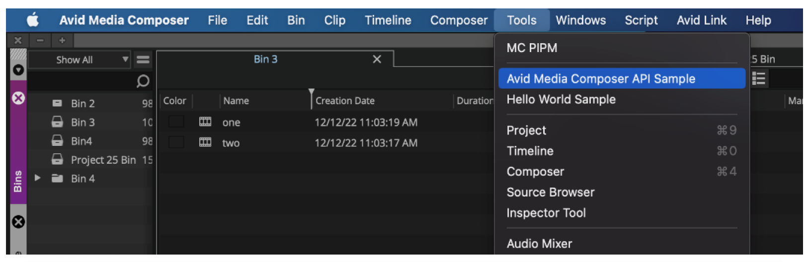

<!--
focus: false
bg: "#ffffff"
-->

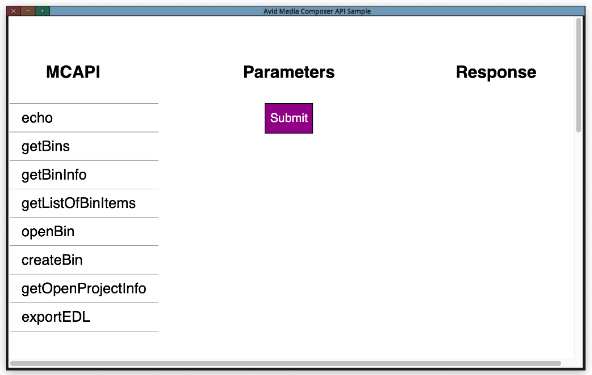

6. Navigate to `localhost:6123` in your browser.
7. Click `Avid MCAPI Sample`.

<!--
focus: false
bg: "#ffffff"
-->

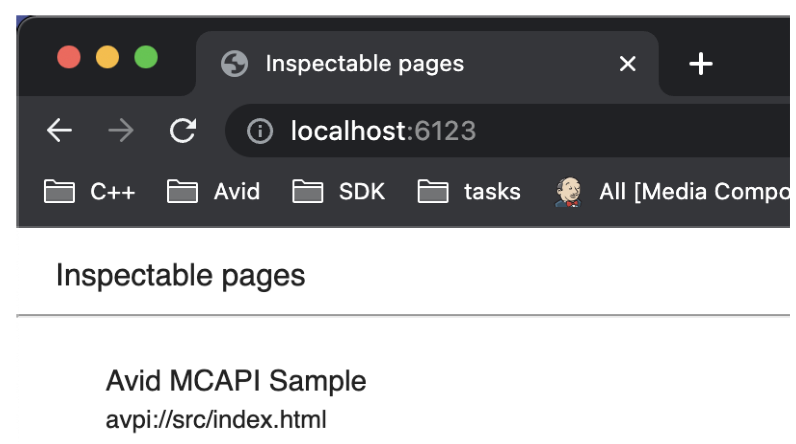

8. Click the **Sources** tab at the top of the debugging page
9. Navigate to `mcapi-echo.js` file (see screenshot)
10. Set a breakpoint.

<!--
focus: false
bg: "#ffffff"
-->

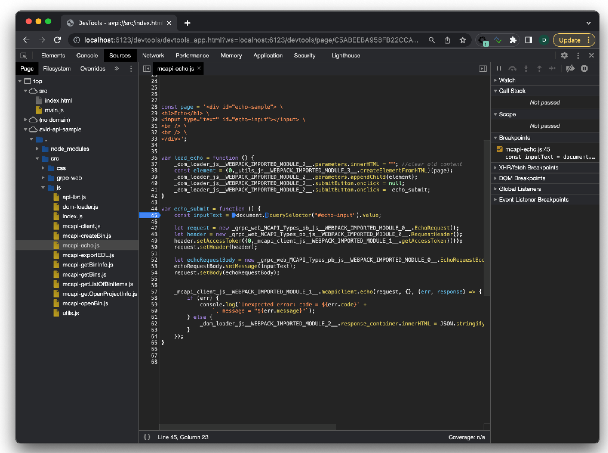

11. Click `echo` in the left hand column of the panel window. Enter text into the text box of the middel column and submit.

<!--
focus: false
bg: "#ffffff"
-->

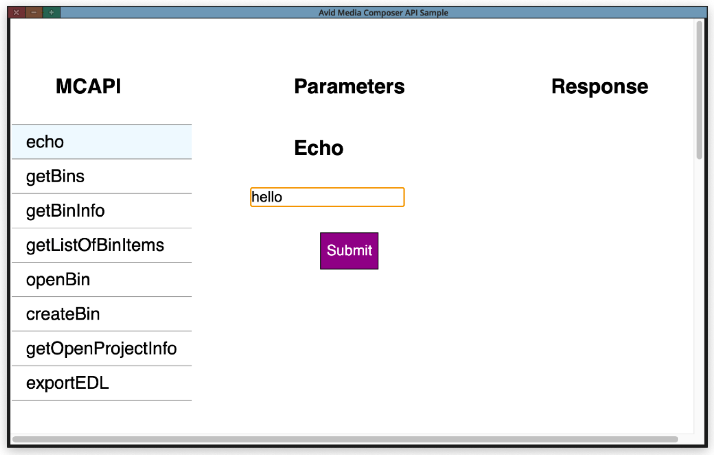

The application sends a request to Media Composer. In this example, the echo API will be called, therefore the breakpoint we previously set will be hit (see screenshot). You can then step over the code, check the variable values, etc.

<!--
focus: false
bg: "#ffffff"
-->

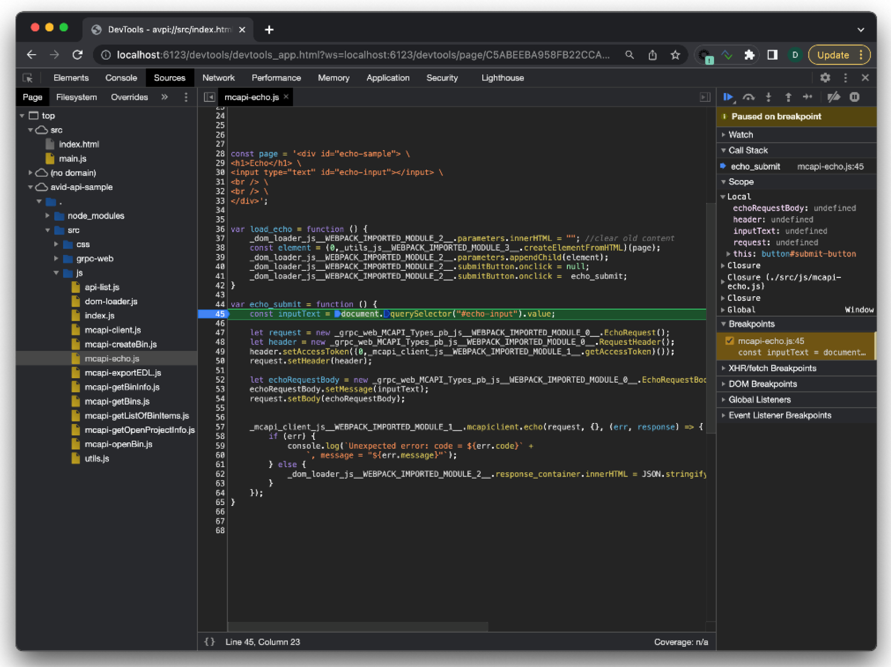

Similar to the echo sample code, you can check out other APIs by navigating to a different file and follow the same steps as above.

**On Windows**

Before launching Media Composer, we need to set environment variable to enable JavaScript debugging in the browser.

```
QTWEBENGINE_REMOTE_DEBUGGING=<port> 

```

Run these two commands on the command prompt:

```
set QTWEBENGINE_REMOTE_DEBUGGING=6124
"C:\Program Files\Avid\Avid Media Composer\AvidMediaComposer.exe"

```
<br>

<!--
focus: false
bg: "#ffffff"
-->

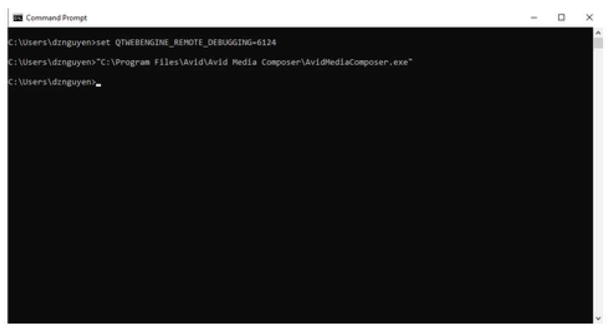

4. Open the project after Media Composer has launched.
5. Open “Avid Media Composer API Sample“ from the Tools menu.

<!--
focus: false
bg: "#ffffff"
-->

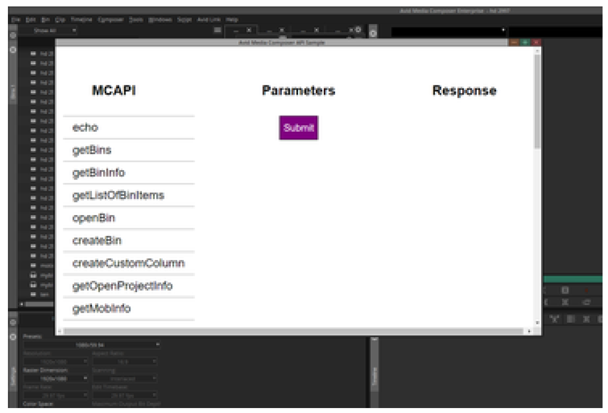

6. Open the Chrome browser to `chrome://inspect`.
7. Click the Configure.
8. Enter `localhost:6124` in the small dialog that appears.

<!--
focus: false
bg: "#ffffff"
-->

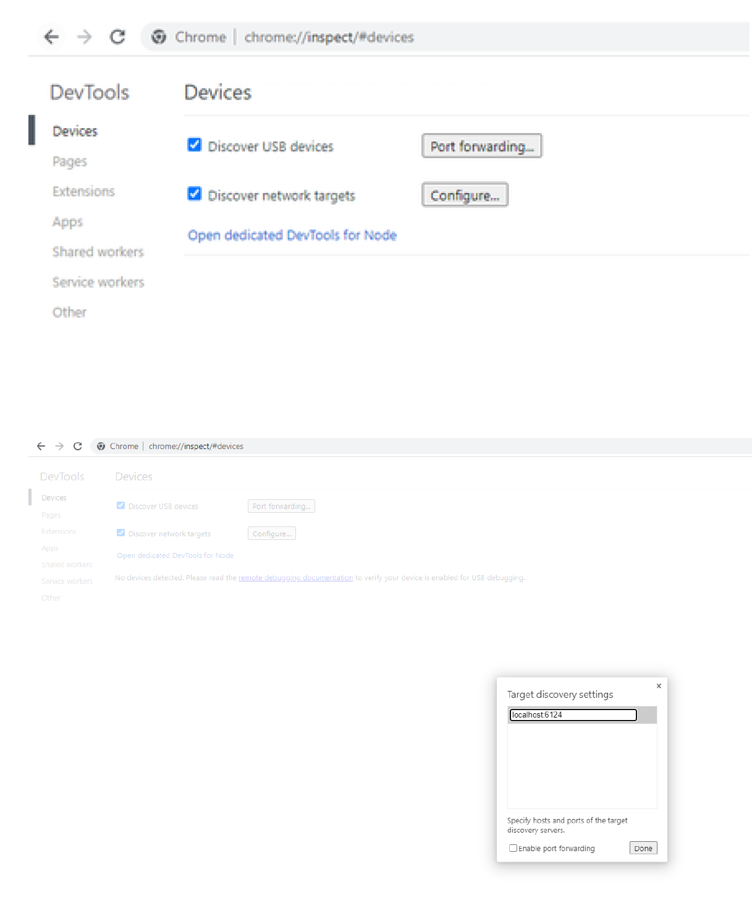

9. The plugin will be listed under Remote Target after a few seconds. Click `Inspect Link` to oopen the dev tool.

<!--
focus: false
bg: "#ffffff"
-->

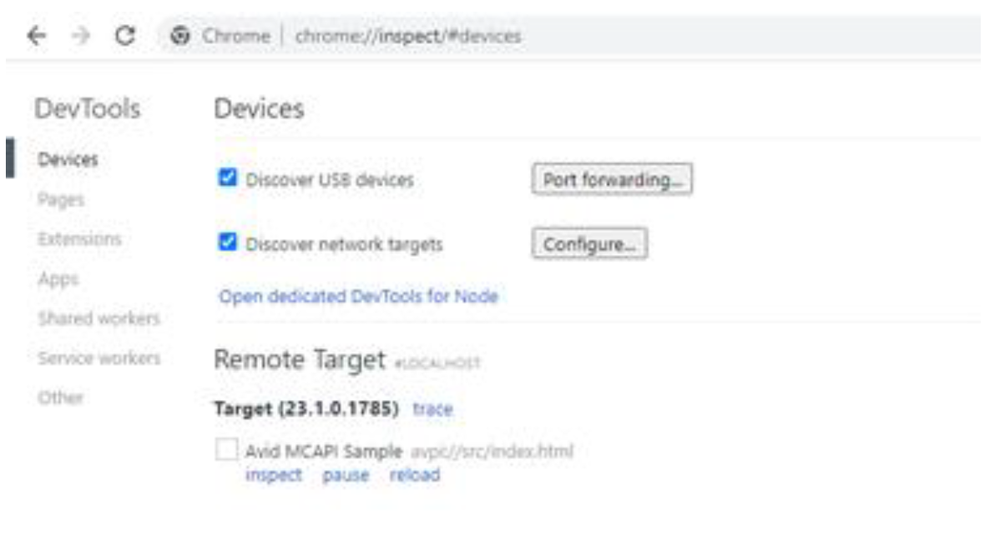

10. Open the **Sources** tab and navigate to a JavaScript file. 

> Please do not interact with the plugin UI displayed on the left side because it may crash Media Composer. Only use the panel window within Media Composer.


