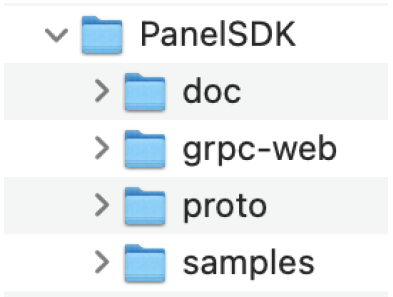

# The Media Composer HTML Panel Development Process

## Introduction 

This document outlines the content structure found in the PanelSDK bundle as well as deployment options.

<!--
focus: false
bg: "#ffffff"
-->

## Documentation

The documentation in the PanelSDK/doc folder. It is automatically generated from the files in PanelSDK/proto using the protoc-gen-doc protoc plugin from OS project on github using a customized html.tmpl file. We welcome any suggestions for improving this auto-generated documentation.

## JavaScript API

The only API that we provide is in the `grpc-web` folder. This is a pure JavaScrip-based for the MC API that is generated by the protoc-gen-grpc-web plugin from grpc-web project provided by Google.

## Deployment Options

There are many possible types of deployment for Panel SDK plugins. Which one to use depends on the requirements of the web service interaction. Here we only outline a few of the possible deployments.
If your service needs to use other languages bindings such as Java, Node, Python, or even C++, you can generate them directly from our Google Protobuf proto files in the `proto` directory.

In every deployment option, the zip compressed plugin bundle must have the .avpi extension and be signed by the developer and Avid.

## Plugin bundle redirects to remote URL (Preferred)

The local installed compressed plugin bundle only contains the manifest file with “url” property
referencing a remote URL that hosts your website.
The simplest website will contain a copy and `grpc-web` folder with custom code that
includes the contained “grpc-web/client.js” file and then adds code to call the API functions.
This is the preferred deployment because it is also the most flexible because it has the following
advantages:

- On-board the plugin bundle once for the lifetime of a given remote URL
- Update new versions of remote website is independent from installed bundle.

This is particularly convenient for developers because they can test new versions of their
PanelSDK window without quitting and restarting Media Composer. Forcing a page reload
should be sufficient.

### Plugin bundle redirects to localhost URL

This almost the same as the remote URL except that its major drawback is that it will require a
custom installer for Mac and Windows. Consequently, it has the following disadvantages:

- Each plugin .avpi must go through the Avid on-boarding process
- New installers will need to be updated with the on-boarded bundle and the entire local
service
- The local service and the installers themselves may need platform specific processes
- The installer must be downloaded and run by a user with Administrator privileges.
- Increases testing overhead

Despite these inconveniences, some developers may need this type of local deployment to give
them the the necessary control of the local computer running Media Composer.

### Completely self-contained compress bundle/package

The entire website is compressed into an .avpi and on-boarded for each version that needs to be deployed. Please run webpack to make the directory self-contained before zipping the contents to create the .avpi. If you have copied one of the samples, then running “npm run build” will do these operations automatically.

This may only be suitable for very simple grpc-web panels. Other language proto bindings will need to provide a web server, either remote or installed on the local computer running Media Composer.

## Quick Start Guide - Remote URL

1. Provide DeviceIDs for all developer and QA test computers that will need to run Media Composer with PanelSDK features enabled.
2. Avid will provide the required Media Composer | Enterprise licenses and encrypted files for each DeviceID and instructions on where to place them on the development and test systems.
3. Avid will provide download site for pre-release version of Avid Media Composer with the corresponding version of the PanelSDK.
4. Install npm, the node package manager. It is only required for building
5. Include the *_pb.js files from the `grpc-web` into your website.
6. Clone the RemoteURL example (TBD).
7. Change on the text avid-manifest.json to match your project with your remote URL in the “url” property of the avid-manifest.json file.
8. zip the contents of your renamed plugin folder to a .avpi file, e.g. run `zip -r ../helloworld.avpi *` after cd into helloworld. In this case, .avpi will only contain the avid-manifest.json file.
9. Place the new .avpi file into `PanelSDKPlugins` folder in Media Composer’s SupportingFiles folder. (The PanelSDKPlugins folder is located at %ProgramData%\Avid\PanelSDKPlugins on PC and /Library/Application Support/Avid/PanelSDKPlugins on Mac)
10. Make sure you site is online.
11. Launch Avid Media Composer
12. Your Panel SDK plugin should be listed in “Tools” menu with the name using the `displayText` property from your avid-manifest.json.

## Known Limitations

- The current version of Avid Media Composer is using Qt 5.15.3 with Chromium 87 with some more recent security fixes ported back. Please plan for your web pages to work in this older version.
- The version of Chromium inside qtwebengine is built without any proprietary codecs. For example, there is no support for H.264 and MPEG layer-3 (MP3). It does support WebM though, a format designed to provide a royalty-free, high-quality open video compression format for use with HTML5 video. WebM supports the video codec VP8 and VP9.