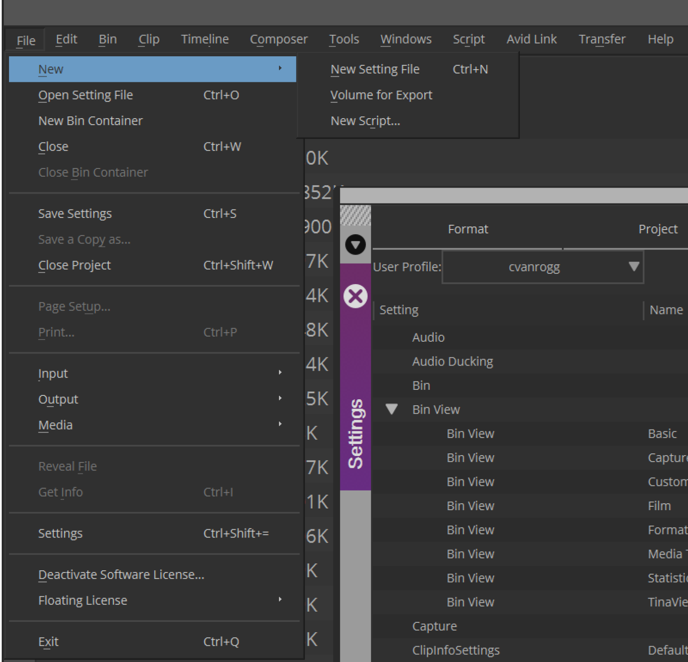
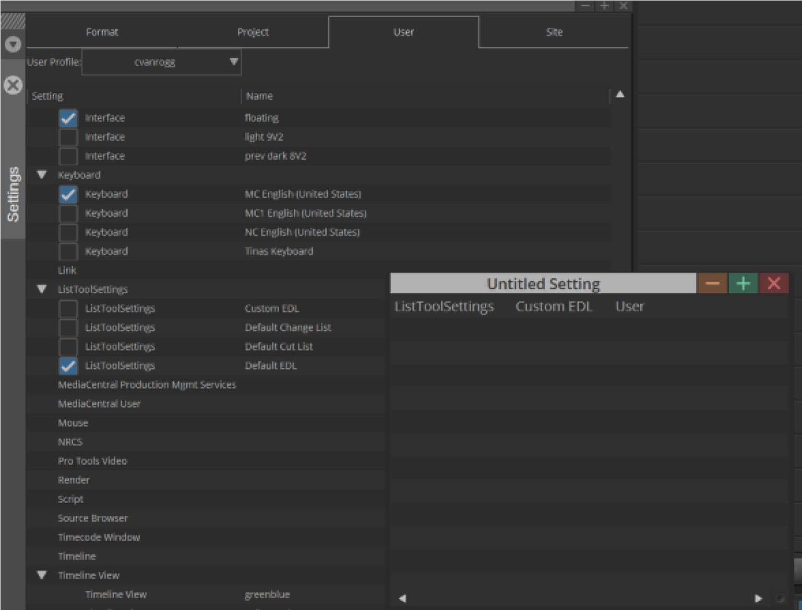
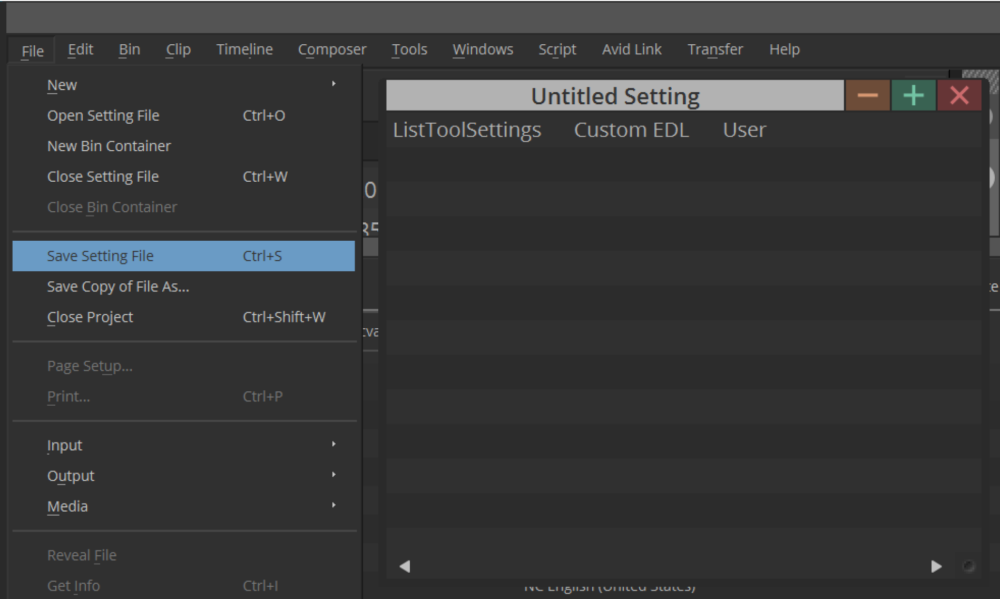
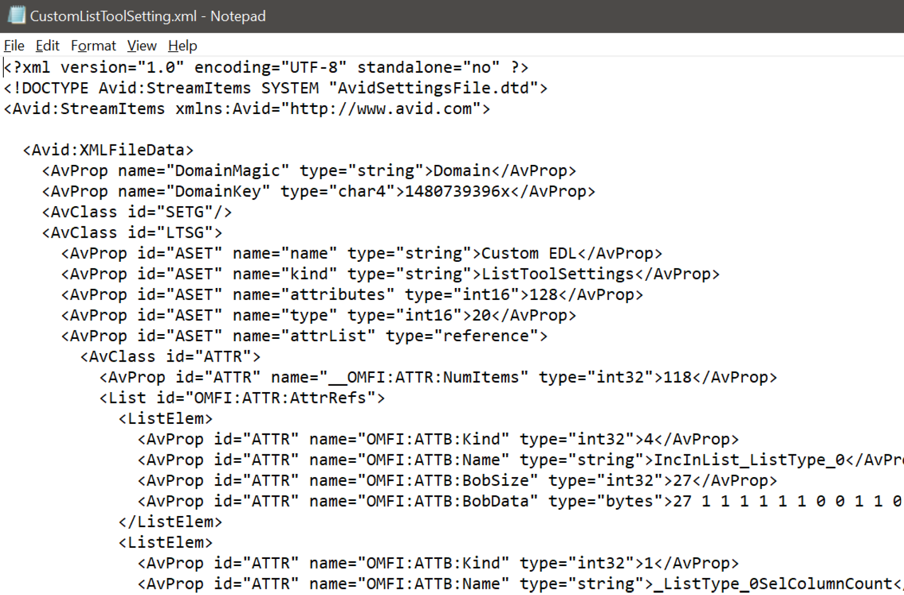

# Create a Media Composer Setting File

## Introduction 

In this tutorial, you will learn how to creating a file containing a specific subset of Media Composer settings. The information is useful for several workflows, including customer workflows that involve saving and restoring a single setting when creating a new user setting.

> When creating a setting file for use in the Panel SDK’s `LoadSetting()` API, please a vendor prefix in you setting name. 
>
> Example: “CompanyName - Custom EDL”.

## Steps

To create a file that contains one or more specific settings but not the full list of settings:

1. Open the Settings window.
2. Make sure the Settings window is active
3. Select File > New > New Setting File

<!--
focus: false
bg: "#ffffff"
-->

A small window titled **Untitled Setting** opens. 

4. Drag one or more settings from teh Settings window to this window.

<!--
focus: false
bg: "#ffffff"
-->

5. Choose **File > Save Settings File**

<!--
focus: false
bg: "#ffffff"
-->

6. Navigate to a folder and choose a file name. You can then view the resulting .xml file.   

<!--
focus: false
bg: "#ffffff"
-->

