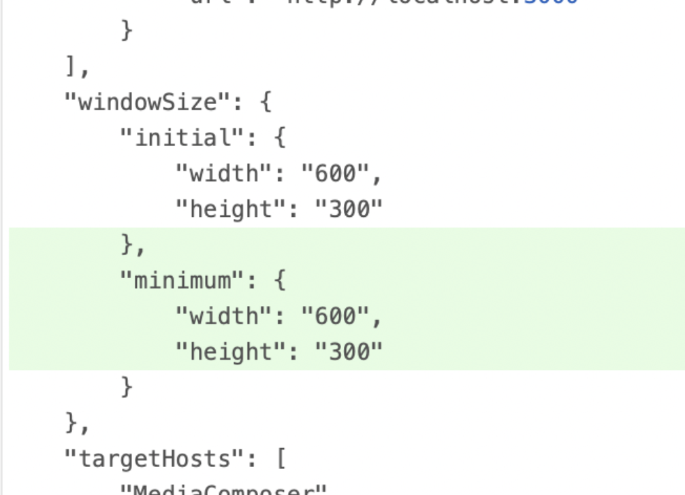
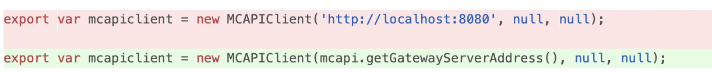

# Releases

## Panel SDK Release Notes

## Panel SDK Drop 14 - 2024.12.3
Panel SDK Drop 14 is aligned with Media Composer 2024.12.3.

This release contains more transport APIs and bug fixes.

For further information see:

[ReadMe](https://resources.avid.com/SupportFiles/attach/README_Avid_Editor_v24.12.3.pdf)

**New APIs:**
- SetPosition
- GetListOfWindows
- MakeWindowActive
- GetListOfSequenceTemplates
  - NewSquence missed the cutoff for this releases.

**New Notifications:**
- AboutToPlayEvent
- DonePlayingEvent
- ActiveMonitorChangedEvent

**Updates:**
- Fixed scanAvidMediaFilesFolder now correctly filters to requested list of files.
- Fixed StartPlay to correctly handle invalid offset or timecode.


## Panel SDK - 24.12.2
Updated with the new APIs and bug fixes from Media Composer 25.6.

For further information see:

[ReadMe](https://resources.avid.com/SupportFiles/attach/README_Avid_Editor_v24.12.2.pdf)


## Panel SDK Drop 13 - 2025.6
Panel SDK Drop 13 is aligned with Media Composer 2025.6, the first release in 2025.

For further details see:

[What's New](https://resources.avid.com/SupportFiles/attach/WhatsNew_MediaComposer_v25.6.pdf)

[ReadMe](https://resources.avid.com/SupportFiles/attach/README_Avid_Editor_v25.6.pdf)

This Panel SDK drop contains initial implementations for some of command and transport APIs and also some requested bug fixes.

**New APIs:**
- GetListOfCommands
- IsCommandsEnabled
- DoCommand
- StartPlay
- StopPlay
- AddMarker, AddMarkers and ChangeMarker now has an optional field for an SVG overlay
  - The SVG overlay must be transparent and match the original aspect ratio to be scaled and drawn properly on the frame in the Marker Tool window.

**New Notifications:**
- Add DoCommandFinished

**Updates:**
- Fixed 'windowTitle' from manifest is now correctly used for the title of the panel window.
- Fixed LoadMobsIntoViewer to properly load sequences into the record monitor of the Composer window.
- Fixed Unsigned panels no longer need a "companyPrefix" set to "avid" to be displayed in the Tools menu during development.
- Fixed GetMediaVolumeItems error message to more accurately describe the the case where a media volume returned from GetMediaVolumes does not _yet_ have an "Avid MediaFiles" directory.
- Fixed ConfigureSRTStream writing a password where previous releases could only set the password from the SRT Configure dialog.
  - To set a password, set 'use_password(true)' and specify the 'password(string)' and 'secret_suffix(string)'.  The values for 'password' and 'secret-suffix' must both be non-empty strings.

**Known issues:** 
- There are no APIs yet for getting or setting the context before calling DoCommand.
- Streaming Connection breaks after 10 second

---
## Panel SDK Drop 12 - 2024.12
Panel SDK Drop 12 is aligned with Media Composer 2024.12 Long Term Maintenance (LTM) release.
Notably for Panel developers Media Composer 2024.12 features:
- First release of Media Composer running natively on Mac ARM processors
- Embedded Chromium upgraded from v87 to v108

For further details see:

[What's New](https://resources.avid.com/SupportFiles/attach/WhatsNew_MediaComposer_v24.12.pdf)

[ReadMe](https://resources.avid.com/SupportFiles/attach/README_Avid_Editor_v24.12.pdf)

This Panel SDK drop focusses on resolving many outstanding bug requests and minor API updates.

**New APIs:**
- Added Open flag to GetBins API
- Added Newer Marker colors as result of Media Composer and ProTools interoperability enhancements

**New Notifications:**

**Updates:**
- Extended Check that gateway connections from Panels come from an Avid Signed process binary
- Fixed Panel SDK error handling inconsistency
- Fixed ScanAvidMediaFilesFolder does not work on a newly created media sub-directory
- Fixed ExportFile returns error even if the file was successfully exported
- Fixed Reloading the panel window causing connection issues
- Fixed On Mac after launching Gateway, Media Composer sometimes fails to connect to server
- Fixed Panel’s window name to be windowTitle instead of displayText
- Fixed In the COLOR user workspace, the timecode values don't update with GetViewerMobs
- Fixed Message from SDK contains garbage characters

**Known bugs:** 
- Media Composer 24.12.0 incorrectly reports "PanelSDK_24.10" for the sdkVersion.
- Streaming Connection breaks after 10 second

---

## Panel SDK Drop 11 - 2024.10

**New APIs:**
- DeleteMarkers
- GetListOfJobQueues

**New Notifications:**

**Updates:**
- Added field for supported SDK version to GetAppInfo
- Added support newest marker color (added in 2024.6)
- Added Open flag to GetBins API
- Fixed minimum window size
- fixed error message translation

**Known bugs:** 
- streaming: connection breaks after 10 second

---

## Panel SDK Drop 10 - 2024.6

**New APIs:**
- LinkFile
- GetListOfLinkSettings
- MoveBinItem
- CopyBinItem
- DuplicateBinItems
- ChangeMarker

**New Notifications:**

**Updates:**
- Every MC Panel starting from 2024.6 is available for all of MC licences. Panel SDK 2024.2 and 2023.12 requires Media Composer Ultimate of Enterprise licence.
- Bug fix: import file should not duplicate media creation setting anymore

**Known bugs:** 
- streaming: connection breaks after 10 second
- AddMarker, AddMarkers, GetMarkers and ChangeMarker do not support newest marker color (added in 2024.6)

---

## Panel SDK Drop 9 - 2024.2

**New APIs:**
- CloseBin API - close specified bin
- CreateSubClip - create subclip in bin base on clip or sequence works similar to Batch Subclip Tool
- GetHostInfo - returns workstation name
- GetBinColumnInfo - get information about all bin columns of the specified bin

**New Notifications:**
- onExportFileStarted
- onExportFileFinished
- onImportFileStarted
- onImportFileFinished

**Updates:**
- SetMobInfo API not allows changing color column
- Added the ability to specify destination bin for new media files. CreateClipsFromAvidMediaFilesFolder takes new parameter: media_file_path. 
- ExportFile API - added the ability to track export status and add notification
- Add sample code for GetAppInfo API
- Update sample to demonstrate how to connect to new notifications: onExportFileStarted, onExportFileFinished, onImportFileStarted, onImportFileFinished.
- Update companyPrefix property in all avid-manifest.json files used in the sample code. **companyPrefix** must be a unique company name.
- All documents in PanelSDK zip bundle are now in markdown format. 

**Known bugs:** 
- streaming: connection breaks after 10 second

### Release 23.12 
This is a gold release which is based on Release 0.8 and is compatible with Media Composer 2023.12

---

## Release 0.8    December-2023  
**New API:**

- GetMarkers
- SelectMobsInBin
- AdddMarkers
- GetViewerMobs
- GetMediaVolumeItems
- GetBinFromMob

**New notifications:**

- Add MobDeleted notification
- Add Open/Closed Bin notifications

**Sample code updates:** 
- Add sample code to deal with errors returned from APIs ( inside ExportFile sample )
- ExportFile added settings combo box
- Update “notification” sample plugin: 
    - update README
    - update sample code to demonstrate new notifications: 
        - MobDeleted
        - Open/Closed Bin
- Add ImportFile sample code
- Add ScanAvidMediaFilesFolder and CreateClipsFromAvidMediaFilesFolder sample code ( in basic-api sample)
- Update Drag and drop sample code to demonstrate dragging URL link from the panel to Media Composer
- Update testdomain sample code to demonstrate how to create anchor link which would be opened with external browser

**Panel window updates:**
- The PanelSDK window is now dockable. 
- Add open external links in system browser

**Known bugs:** 
- exportFile/importFile: request connection breaks after few second 
- streaming: connection breaks after 10 second

---

## Pre-Release 0.7    5-September-2023
**New API:**
- LoadMobsIntoViewer

**New notifications:**
- BinRowSelectionChanged
- MobAdded
- PlayPositionChangeEvent
- MobLoadedInViewer
- DropFromPluginToBin
- DropFromPluginToComposer
- DropFromPluginToTimeline

**API changes:**
- exportFile: allows setting export file name

**Documentation changes:**
- Update “Advanced Configuration.pdf” to include log level configuration of the gateway.

**Sample changes:**
- Fix addMarker API sample code
- Add loadMobsIntoViewer sample code
- Update dragndrop sample plugin to include new drag and drop notifications:
    - DropFromPluginToBin
    - DropFromPluginToComposer
    - DropFromPluginToTimeline
- Add README for echo sample code
- Update README for exportEDL sample
- Update “notification” sample plugin: 
    - update README
    - update sample code to demonstrate new notifications: 
        - BinRowSelectionChanged
        - MobAdded
        - PlayPositionChangeEvent
        - MobLoadedInViewer
- Update README for “testdomain” sample plugin

**Known bugs:**
- exportFile: sometimes export is successful but still returns error
- exportEDL sample code doesn’t display all EDL export settings. 

---

## Pre-Release 0.6 - 14-June-2023

**With this release, you will need to make the following changes:**

1. Stop avid-mcapi-gateway from Task Manager or Activity Monitor. On PC: Remove the previous gateway.exe that you were given separately. (on Mac this was part of the installer)

2. Use the new daily builds that are provided with the drop.  As always, the contents of the integration zip file are meant to be used with the corresponding daily Media Composer build.

3. Modify your plugin to use the new method to access the token. See the Sample changes section below.

4. The toggle for the Panel SDK feature has been turned on in the daily build.  Please remove the PreReleasedFeatures.ftf file that you were given.  It is no longer needed. But you will continue to need the SDKDeveloperToggles.ftf file if your bundle is not signed yet.

5. Plugins are stored in a new location. Please copy your existing plugins or install your new ones at: <br><br>

    **Windows:** `%ProgramData%\Avid\PanelSDKPlugins` <br>
    **Mac:** `/Library/Application Support/Avid/PanelSDKPlugins`

**Updates:**

- A new, more fully functional Gateway has been added. The new Gateway provides augmented security.

    > Important: If you run Media Composer on a system without the encrypted SDKDeveloperToggles.ftf file, then your bundle must be signed by you and also Avid. Please contact Avid if you are ready to deploy your bundle to your customers and you need it to be signed.

- The ExportEDL API was changed to return an error if the Setting name provided cannot be found.

- The ImportFile API was changed to return the mob that was created

- The GetAppStatus API was renamed to GetAppInfo <br>

**New APIs & notifications:**

- ProjectOpen notification
- ConfigureSRTStream, GetSRTStreamSettings, SetOTSSessionStatus, GetOTSSessionStatus APIs

**New Console command: “panelsdk reinit“**

- This new console command enables reloading of plugins without relaunching Media Composer. 

- If you make modification to your plugin, follow these steps in order to reload plugins without restarting Media Composer:
    - Go to Task Manager or Activity Monitor, kill avid-api-gateway process.
    - Rebuild your avpi file and reinstall it.
    - Go to the Console Command window (Ctrl + 6), type 

```
panelsdk reinit
```

Please note that this command will delete all existing instances of plugins. Any opened Panel SDK window will be closed. 

**Documentation changes:**

- A new Getting Started doc was created.
- The Basic Tutorial doc was updated regarding where to place samples, getting the Access Token, and reporting API call error to Media Composer.
- The API documentation includes the new changes to the ImportEDL, ImportFile, and GetAppInfo APIs.
- The Notification.md file includes the new and the change to the ProjectOpen notification.

**Sample changes:**

- A sample was added for AddMarker API
- A sample was added for ProjectOpen notification
- Several samples were modified to demonstrate use of the completed event for streams
- Samples were modified to show the new way to get the access token.
- Some samples were updated with error reporting back to Media Composer.
- Added new sample plugin to demonstrate how to upload exported files to a remote server. See PanelSDK/samples/helper-service.  

---

## Pre-Release 0.5 - 27-Mar-2023

**Updates:**

The ImportFile and ExportFile APIs now return better error handling.

The GetMobTrackInfo API now additionally returns the audio track type (mono, stereo, 5.1 etc)

Fixed the use of Min size from the Manifest file.

**New APIs:**

- AddMarker

**Documentation changes:**

The Basic Tutorial contains new information about including API scopes in the Manifest file. We will be enforcing API scopes soon. 

The API documentation includes the new AddMarker API and the change to the GetMobTrackInfo API.

**Sample changes:**

The samples' Manifest files were updated with regard to use of Min size and API scope

<!--
focus: false
bg: "#ffffff"
-->


- A new mcapi-getMobTrackInfo.js sample was created

---

## Pre-Release 0.4 - 23-Feb-2023

**Fixes:**

- New changes were checked in to allow webpages from the subdomains to be loaded in the web panel. For example, 

- if  “company.com ” is specified in the avid-manifest.json file, all subdomains of company.com  will be allowed. 

- If “sub.company.com” is specified, only subdomains of sub.company.com will be allowed:

- sub.company.com will be allowed.
- abc.sub.company.com will be allowed.
- sub2.company.com   will NOT be allowed.

**New APIs:**

- LoadSetting
- GetListOfImportSettings
- GetListOfExportSettings

**Documentation changes:**

- New document added, related to new LoadSetting API: “Creating a file containing a specific subset of Media Composer settings”
- The Debugging tutorial and the Basic Tutorial were updated.
- The API documentation includes the new APIs.

Sample changes:

samples were added for the new APIs.

---

## Pre-Release 0.3 - 06-Jan-2023

**Fixes:**

- Launch issue with gateway process
- Media Composer hang at exit 

**New APIs:**

- ImportFile

Updates: 

Port 8080 will no longer be used. When creating an MCAPIClient instance, please use mcapi.getGatewayServerAddress()

<!--
focus: false
bg: "#ffffff"
-->


**Documentation changes:**

- New Debugging tutorial
- These pages were updated: 
    - Basic Tutorial
    - MC HTML Panel Developer Process

- APIs that were designed but not yet implemented were removed from the API documentation 

**Sample changes:**

- Use mcapi.getGatewayServerAddress() instead of “localhost:8080“ when creating an mcapi client instance.
- Update prebuilt helloworld.avpi plugin
